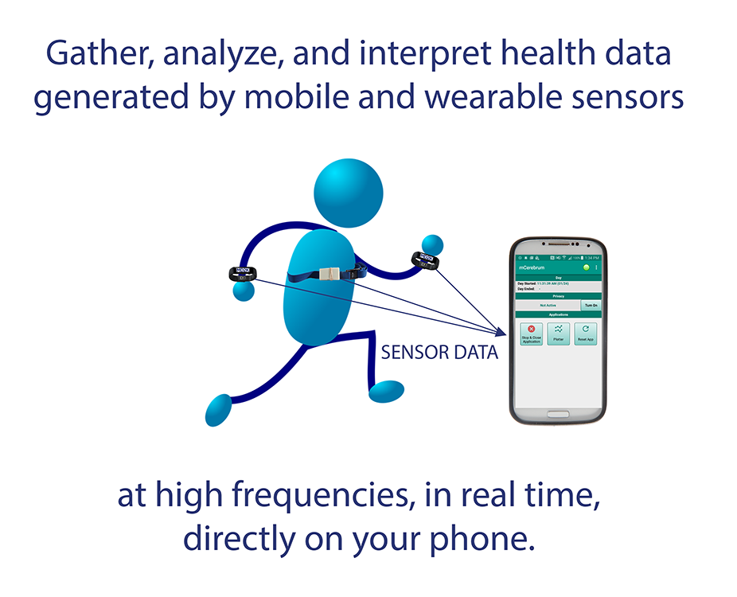

# MD2K Software Platform

<iframe src="https://www.youtube.com/embed/uSQn2puExxM" width="560" height="315" frameborder="0" allowfullscreen="allowfullscreen"></iframe>

## Introduction
The MD2K software includes a smartphone platform called mCerebrum and a cloud counterpart called Cerebral Cortex.

**mCerebrum is a configurable smartphone software platform for mobile and wearable sensors.** It provides support for reliable data collection from mobile and wearable sensors, and real-time processing of these data for sensor-triggered just-in-time adaptive interventions.

**Cerebral Cortex is the big data cloud companion** of mCerebrum designed to support population-scale data analysis, visualization, model development, and intervention design for mobile sensor data. It provides the ability to do machine learning model development on population scale data sets and provides interoperable interfaces for aggregation of diverse data sources.

While MD2K is not a recruitment tool nor a server host, our software can be installed and used by anyone who wishes to advance research in mobile health using cutting edge techniques in high-frequency data collection, real-time intervention, and all the other unique capabilities MD2K can offer.

## Uniqueness of MD2K

Mobile health data solutions are emerging and evolving every day. While most of these software platforms are primarily designed for low-frequency data collection, the [MD2K](https://www.github.com/MD2Korg/) platform is designed from the ground up as a **high-frequency** data stream processing toolchain that provides flexible data types and custom object storage. It can collect and analyze data from tens of wearable sensors via a wide array of wireless radios (ANT, Bluetooth, Bluetooth LE, etc.). It also provides native support for triggering notifications, self-report prompts, and interventions based on **real-time** values of digital biomarkers derived from sensor data.
