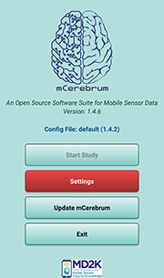
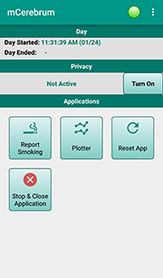

# Getting Started
mCerebrum is a suite of several Android applications that are combined with a set of configuration files. All source code is available in [MD2K's GitHub organization](https://github.com/MD2Korg).

These instructions will guide you in downloading, installing, and configuring the mCerebrum software suite using the default configuration to collect phone sensor data.

## Installation
1. Download the [latest version of mCerebrum](https://github.com/MD2Korg/mCerebrum-Study/releases/latest) and install the APK file on an Android 5.0+ device.
2. Follow the on-screen instructions on your Android device to complete the installation.
3. When the installation is complete, open mCerebrum. You should see the home screen as shown here:

## Configuration
1. Tap the Settings button (highlighted in red) to begin the setup process.
2. If prompted to download a configuration file, enter “default” and tap OK to use the default mCerebrum configuration file. If you are not prompted, skip this step.

## Install/Update Apps
mCerebrum uses a suite of software applications in conjunction with the main mCerebrum interface app. Follow these steps to download the latest versions of the apps in the mCerebrum suite.

1.	From the main Settings screen, tap *Configure Applications > Applications* then tap the Check Updates button at the bottom of the screen.
2.	If any apps listed show a red X icon, tap the app in the list then tap *Install*. If any apps listed show a yellow caution icon, tap the app in the list then tap *Update*.
3.	When every app shows a green check mark, all apps are installed and up-to-date. Tap the *Close* button.

## Sensors Setup
1.	From the main Settings screen, tap *Configure Applications > Settings > PhoneSensor*.
2.	You will see a list of all the available sensors included with your phone (Battery, Location, Accelerometer, etc.). Tap to toggle on each sensor that you wish to use to collect data.
3.	When you are finished, tap the *Save* button at the bottom of the screen.

*Note*: To ensure high-quality data collection, the GPS feature of the smartphone must be set to High Accuracy Mode in your phone’s main settings (outside of the mCerebrum app).

## Study Setup
1.	From the main Settings screen, tap *Configure Study*.
2.	Tap *User ID* and set your desired unique user ID for the participant.
3.	Tap *Wakeup Time* and select the time you expect data collection to begin each morning. The participant will receive a prompt to “start the day” at the time you select.
4.	Tap *Sleep Time* and select the time you expect data collection to conclude each day.
5.	If all items on the Study Settings screen show a green check mark beside them, study setup is complete.  Tap the *Save* button at the bottom of the screen.

## Start Study
1.	From the main Settings screen, once Configure Applications and Configure Study show a green checkmark, tap the *Start Study* button to begin the study.
2.	If prompted to start the day, tap the *Start* button to begin data collection.
3.	Tap *Close* to exit the Settings screen. You should see the mCerebrum home screen below. Once you have tapped to start the day, data collection has begun.

## Visualize Real-Time Data
1.	From the mCerebrum home screen, tap the *Plotter* button.
2.	Select from the list of available sensors to visualize each set of data in real-time.

## Export Data
When you are ready to export the data you have collected, perform the following steps to save your data to a computer.
#### Shut Down All Applications
1.	Enter the main Settings screen by tapping the 3 dots in the upper-right-hand corner of the home screen, then tapping *Settings*.
2.	Tap the *Running Apps* button. (*Note*: the study must be started to access running apps.)
3.	Tap the *Stop All* button to stop all applications.
4.	Return to the previous screen and tap *Stop Study*.
5.	Restart the phone.
6.	When the phone restarts, if the mCerebrum app opens, tap *Exit* to close it. (If mCerebrum does not open, skip this step.)
7.	From the phone’s home screen, open the DataKit app and ensure it is INACTIVE.

#### Save Data to a Computer
1.	Connect the smartphone to a PC using the charging cable.
2.	Create a new folder on your computer. (It may be helpful to use the participant’s user ID as the new folder name.)
3.	Using the computer, navigate to the phone’s org.md2k.datakit folder. *[Phone > Android > data > org.md2k.datakit]*
4.	Copy the org.md2k.datakit folder and paste it to the new folder you created on your computer.
5.	Navigate to the phone’s log folder. *[Phone > log]*
6.	Copy the log folder and paste it to the new folder you created.

All data is now exported to the computer.
