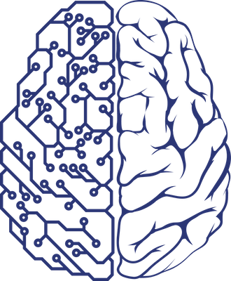
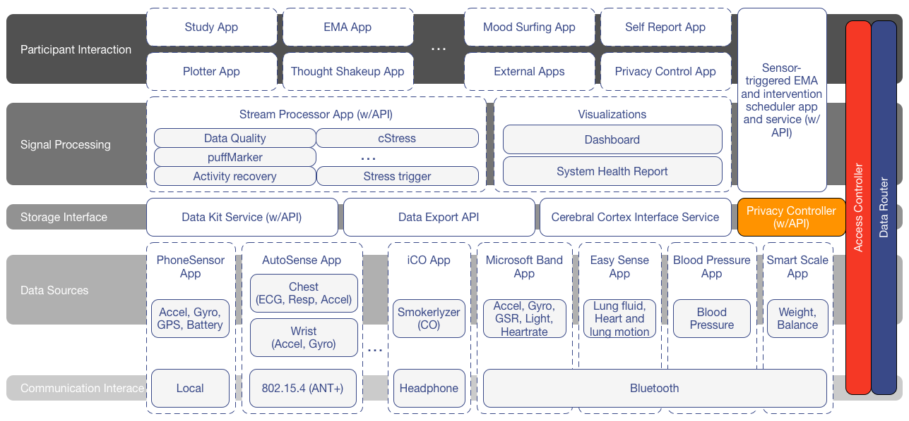

# mCerebrum
**An Open Source Software Suite for Mobile Sensor Data**

<!--  -->

<iframe src="https://www.youtube.com/embed/GR3pahhXp4U" width="560" height="315" frameborder="0" allowfullscreen="allowfullscreen"></iframe>

## Functionality and Architecture of mCerebrum

mCerebrum is a configurable software platform for mobile and wearable devices. The mCerebrum platform is divided into functional layers so that each component is flexible and can be adapted and extended without adversely affecting the other components.  Two components – an access controller and data router – links each layer.  The access controller is responsible to ensuring that pairs of components within the system have appropriate credentials to communicate with each other through the data router, which is responsible for routing data objects throughout the platform.

To meet future needs, we anticipate continuing to adapt and augment the mCerebrum platform to support future technologies and the needs of new studies. The component-based architecture is easily modified and adapted to specific studies and the simple APIs should provide for easy integration into existing applications. mCerebrum has the following layers and associated application components:

## Mobile Sensor Support for Data Collection
mCerebrum provides support for reliable data collection from mobile and wearable sensors in excess of 800 hertz, and real-time processing of these data for sensor-triggered just-in-time adaptive interventions. mCerebrum currently supports a variety of data sources including:

* Microsoft band (accelerometers, gyroscopes, galvanic skin response, UV exposure)
* AutoSense Chest (ECG, respiration, galvanic skin response, accelerometer)
* AutoSense Wrist (accelerometer, gyroscope, galvanic skin response)
* EasySense (ultra wideband radio frequency for lung fluid and cardiorespiratory motion)
* Omron BLE Blood Pressure Monitor (blood pressure)
* Omron BLE Weight Scale (weight, balance, frailty)
* Android smartphones (GPS, accelerometers)
* iCO Smokerlyzer (smoking status)

These sensor platforms communicate with mCerebrum over one of four interfaces: 802.15.4, Bluetooth, headphone port, or local API.

mCerebrum supports real-time data processing algorithms to evaluate stress, activity, driving/riding, smoking, and conversation. mCerebrum collects user reported data collection through EMAs, intervention response, and self reports.

Finally, mCerebrum provides end-to-end access control, encryption, and data source linage along with a simple set of APIs for application development that is freely available under the open source BSD 2-clause license.

### Communication Interfaces

Data sources are either on the smartphone or come from external devices that can be connected to the platform through various radios or wire interfaces:

* 802.15.4 (ANT+)
* Bluetooth
* headphone port
* local

The Microsoft Band, EasySense (lung fluid and heart/lung motion), and Omron (blood pressure and weight) devices have custom applications that utilize the Bluetooth radio to interact with the device and relay data into mCerebrum. [Microsoft Band](https://github.com/MD2Korg/mCerebrum-MicrosoftBand) samples accelerometer, gyroscope, GSR, light, and heart rate for measuring arm movements for eating and smoking behavior detection. [AutoSense](https://github.com/MD2Korg/mCerebrum-AutoSense) receives data from multiple devices over an 802.15.4 (ANT+) radio that includes: Chest, which contains ECG, respiration, and accelerometer data and Wrist, which samples accelerometer and gyroscope information before sending data into Data Kit.  A Bluetooth version of AutoSense is under development for more flexibility in deployments. These two radio chipsets represent most of the wireless communication between wearable sensors and a smartphone and are currently integrated into mCerebrum.

The ICO smokerlyzer is connected to mCerebrum via the headphone jack. Our platform is able to communicate over this connection with the device to measure carbon monoxide of a smoker in the field. The [Phone Sensor](https://github.com/MD2Korg/mCerebrum-PhoneSensor) application can record all available sensors on a smartphone platform and is typically configured to record the accelerometer, gyroscope, GPS, CPU, and battery levels from the device. Once data has arrived on mCerebrum through any one of the interfaces, it is routed via the data router and Data Kit. We have applications that integrate into mCerebrum across a variety of different communication modalities and push data into our common data core, Data Kit, for use by additional signal processing.

### Signal processing
A signal processing layer is responsible for converting sensor data into markers on which the Intervention Kit acts.  The primary real-time data processor, [Stream Processor](https://github.com/MD2Korg/mCerebrum-StreamProcessor), subscribes to data sources produced by the lower tiers and produces markers for the upper tiers.  Currently, it contains signal processing algorithms designed to compute various features and markers including: data quality of raw sensor signals:

* **puffMarker** uses respiration (from a chest band) and hand gesture data (from wrist sensors) to determine when each cigarette puff occurs
* **activity recovery** uses interbeat interval (from ECG) and activity level (from accelerometers) to measure the body’s recovery time after an exercise period as an index of cardiac fitness
* **cStress** uses ECG, respiration, and accelerometer data to an estimated the likelihood of stress for each minute that these sensors are worn properly
* **stress trigger** converts the stress probabilities into episodes of high and low stress that can be used to decide whether to trigger a stress intervention
* **driving detector** that determine if a person is involved in driving a motorized vehicle

The stream processor performs this computation in one-minute blocks that provides near real-time markers for other applications. A visualization layer contains multiple components around displaying the results of the signal processing and can be shown to the participant as necessary but is typically utilized for gaining a sense of how well the system if functioning on the backend.

### Storage interfaces
Storage interfaces provide encrypted data storage and transport capabilities and are subject to the privacy controller, which allows a participant to temporally disable sensor data flow within the system according to rules dictated by the study rules. There are currently three storage interfaces:

* [Data Kit](https://github.com/MD2Korg/mCerebrum-DataKit) is designed to manage and store information produced by all layers and is a key component of mCerebrum data pipeline. It provides an encrypted data store (SQLite) and exposes publisher/subscriber and query interfaces for other components.
* A [Cerebral Cortex](https://github.com/MD2Korg/mCerebrum-CerebralCortex) interface to the system allows for data to be offloaded periodically, depending on quality of service constraints, from mCerebrum via an encrypted REST API over a secure cellular or Wi-Fi network to a Cerebral Cortex cloud service for additional storage and signal processing.
* A [data export](https://github.com/MD2Korg/DataExporter) interface is provided to allow for researchers to extract all recorded information from a mCerebrum device onto a computer for analysis.

### Participant interaction
Participants interact with the system through a suite of applications.

* The [mCerebrum-Study](https://github.com/MD2Korg/mCerebrum-Study) application that provides user interfaces to additional applications and allows for the configuration of the system.
* The [EMA](https://github.com/MD2Korg/mCerebrum-EMA) and [Self Report](https://github.com/MD2Korg/mCerebrum-SelfReport) applications are designed to all for the delivery of scheduled or event-based questionnaires to the participant and to deliver any self-reported information.
* We developed several applications designed around stress reduction techniques, [Mood Surfing](https://github.com/MD2Korg/mCerebrum-MoodSurfing) and [Thought Shakeup](https://github.com/MD2Korg/mCerebrum-ThoughtShakeup), and also support the launching of any external intervention application.
* [Plotter](https://github.com/MD2Korg/mCerebrum-Plotter), a real-time data visualization tool, allows the participant to visualize many of the raw sensor signals to aid in attaching and verifying the quality of sampled data.
* [Intervention kit](https://github.com/MD2Korg/mCerebrum-InterventionKit) is a sensor-triggered EMA and intervention application bridges this layer with the signal-processing layer to provide data-driven and scheduled notifications and interventions. It also provides an API for notifying a participant either through a wearable device or the smartphone via different modalities, which include vibration and sound. The ability to provide just-in-time interventions based on a real-time analysis of high-frequency data streams and its ability to combine diverse data streams from a variety of sensors is a key capability of mCerebrum.

For example, puffMarker uses multiple data streams (respiration, and wrist-based accelerometers and gyroscopes) to detect when a cigarette puff occurs.  This puff information is utilized by the intervention manager to provide alerts to the participant through mCerebrum's notification system that sends a set of configurable messages, tones, and vibrations to a Microsoft band and the smartphone. Failure to acknowledge the intervention or message can result in repeated attempts to contact followed by an escalation of causing additional alerts to be sent.

Similarly, ECG, respiration, and accelerometer data is used by the cStress model to assess the likelihood of stress that is then used to generate triggers for launching stress intervention apps.
