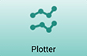

# User Interface
The following is a brief overview of some of the different features found in the user interface of mCerebrum.

## Visualize Real-Time Data
Using the Plotter app included with mCerebrum, you can select from a list of available sensors to visualize each set of data in real-time.

The software displays a real-time plot of whichever data you select. This allows you to easily see if data collection is working as you monitor heart rate, breathing patterns, accelerometers, gyroscopes, and more.

## Privacy
Privacy Control allows users to turn off certain features for a limited period of time.

From the mCerebrum home screen, tap the *Turn On* button under the Privacy heading to access the privacy settings. From there, you can select which of the various sensor data collections and other features you wish to disable for the amount of time you choose. Simply set the timer and then select which features to disable. You will see a countdown timer, and the features will remain disabled until the timer expires.

# Admin Settings
The following is a brief overview of some of the different features found in the admin settings of mCerebrum.

## Study Setup

## Configuration
1. Tap the Settings button (highlighted in red) to begin the setup process.
2. If prompted to download a configuration file, enter “default” and tap OK to use the default mCerebrum configuration file. If you are not prompted, skip this step.

## Install/Update Apps
mCerebrum uses a suite of software applications in conjunction with the main mCerebrum interface app. Follow these steps to download the latest versions of all the apps in your configuration of the mCerebrum suite.

1.	From the main Settings screen, tap *Configure Applications > Applications* then tap the Check Updates button at the bottom of the screen.
2.	If any apps listed show a red X icon , tap the app in the list then tap *Install*. If any apps listed show a yellow caution icon , tap the app in the list then tap *Update*. (Alternatively, you may tap the *Fix All* button at the bottom of the screen to begin the installation of all updates at once.)
3.	When every app shows a green check mark , all apps are installed and up-to-date. Tap the *Close* button.

## Sensors Setup
1.	From the main Settings screen, tap *Configure Applications > Settings > PhoneSensor*.
2.	You will see a list of all the available sensors included with your phone (Battery, Location, Accelerometer, etc.). Tap to toggle on each sensor that you wish to use to collect data.
3.	When you are finished, tap the *Save* button at the bottom of the screen.

*Note*: To ensure high-quality data collection, the GPS feature of the smartphone must be set to High Accuracy Mode in your phone’s main settings (outside of the mCerebrum app).

## Study Setup
1.	From the main Settings screen, tap *Configure Study*.
2.	Tap *User ID* and set your desired unique user ID for the participant.
3.	Tap *Wakeup Time* and select the time you expect data collection to begin each morning. The participant will receive a prompt to “start the day” at the time you select.
4.	Tap *Sleep Time* and select the time you expect data collection to conclude each day.
5.	If all items on the Study Settings screen show a green check mark beside them, study setup is complete.  Tap the *Save* button at the bottom of the screen.

## Start Study
1.	From the main Settings screen, once Configure Applications and Configure Study show a green checkmark, tap the *Start Study* button to begin the study.
2.	If prompted to start the day, tap the *Start* button to begin data collection.
3.	Tap *Close* to exit the Settings screen. You should see the mCerebrum home screen below. Once you have tapped to start the day, data collection has begun.
