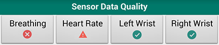

## User Interface
The following is a brief overview of some of the different features found in the user interface of mCerebrum.

### Visualize Real-Time Data
Using the Plotter app included with mCerebrum, you can select from a list of available sensors to visualize each set of data in real-time.

The software displays a real-time plot of whichever data you select. This allows you to easily see if data collection is working as you monitor heart rate, breathing patterns, accelerometers, gyroscopes, and more.

### Privacy
Privacy Control allows users to turn off certain features for a limited period of time.

From the mCerebrum home screen, tap the *Turn On* button under the Privacy heading to access the privacy settings. From there, you can select which of the various sensor data collections and other features you wish to disable for the amount of time you choose. Simply set the timer and then select which features to disable. You will see a countdown timer, and the features will remain disabled until the timer expires.

### Surveys & Interventions
EMA (ecological momentary assessment) surveys and intervention exercises can be delivered to and completed by users directly through the mCerebrum smartphone interface. Surveys can occur at random times or based on triggers such as stress or eating episodes that are detected through wearable sensors.

### Self-Reporting
Self-Report buttons allow users to report the moment an event such as smoking or eating has occurred.

 

### Data Quality Check
Use the icons under the Sensor Data Quality heading on the mCerebrum homescreen to quickly monitor the quality of data collection.

* Green checkmark means good data quality.
* Red caution icon means data is being collected but something is not right (i.e. sensor is not being worn properly).
* Red X icon means no data is being collected (i.e. sensor is not charged).

If experiencing bad data quality, you may tap the sensor icon to access a menu that contains options for troubleshooting tips and real-time data visualization.

### Reset Application

Sometimes resetting the mCerebrum application can quickly fix some sensor data quality issues. Use the Reset App button to streamline the process and reset application features without restarting the entire application. 

## Admin Settings
The following is a brief overview of some of the different features found in the admin settings of mCerebrum.
