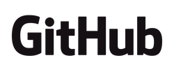
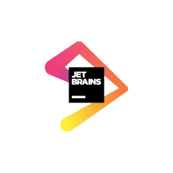

# Software Release Information

## Schedule
MD2K software is released based on a monthly development and testing cycle.  Typically, we allocate **3 1-week sprints** for development activities followed by a **single 1-week sprint** dedicated towards testing.  

- Major `X.0.0` software updates will occur approximately every year
- Minor/Feature `1.X.0` updates will occur each month on the 3rd Wednesday
- Critical bug fixes `1.2.X` will be released immediately

| Year |    Month   | Release Day       |
|------|------------|-------------------|
| 2016 | September  | 2016/09/14  (Wed) |
| 2016 | October    | 2016/10/19  (Wed) |
| 2016 | November   | 2016/11/16  (Wed) |
| 2016 | December   | 2016/12/21  (Wed) |
| 2017 | January    | 2017/01/18  (Wed) |
| 2017 | February   | 2017/02/15  (Wed) |
| 2017 | March      | 2017/03/15  (Wed) |
| 2017 | April      | 2017/04/19  (Wed) |
| 2017 | May        | 2017/05/17  (Wed) |

!!! warning "Feature Requests"
All feature requests should be submitted prior to the scheduled release day of the prior month.  For example, for a feature request to be considered for the September 2016 release, it should be submitted to the [JIRA](feedback) tracker before the August release day `2016/08/17`.  This will allow the software engineers sufficient time to plan and execute the upcoming activities.

## Download

### mCerebrum instructions
mCerebrum is a suite of several Android applications that are combined with a
set of configuration files.  These instructions will guide you in downloading,
installing, and configuring the mCerebrum software suite.  All source code is
available in the [MD2K's GitHub organization](https://github.com/MD2Korg).

1. Download the latest version of mCerebrum ([latest release](https://github.com/MD2Korg/mCerebrum-Study/releases/latest) ) and install the APK file on and Android 5.0+ device.
1. mCerebrum will run and the `Settings` button will be highlighted in red, press it.
1. A prompt will be shown asking you to enter a filename of a configuration file to download, enter `default` and press `OK`.
1. Once a configuration file is successfully downloaded and installed, you will be prompted with an Admin password screen.  The default password is `1234`.
1. Congratulations, you have successfully installed the main mCerebrum application.  Please follow the instructions [here](https://md2k.org/wp-content/uploads/2016/05/M0003.pdf) for configuring the platform

## List of mCerebrum Apps

| Applications                                                                          | Download                                                                                   |
|---------------------------------------------------------------------------------------|--------------------------------------------------------------------------------------------|
| [AutoSense](https://github.com/MD2Korg/mCerebrum-AutoSense)                           | [latest release](https://github.com/MD2Korg/mCerebrum-AutoSense/releases/latest) |
| [Microsoft Band](https://github.com/MD2Korg/mCerebrum-MicrosoftBand)                  | [latest release](https://github.com/MD2Korg/mCerebrum-MicrosoftBand/releases/latest) |
| [Phone Sensor](https://github.com/MD2Korg/mCerebrum-PhoneSensor)                      | [latest release](https://github.com/MD2Korg/mCerebrum-PhoneSensor/releases/latest) |
| [Stream Processor](https://github.com/MD2Korg/mCerebrum-StreamProcessor)              | [latest release](https://github.com/MD2Korg/mCerebrum-StreamProcessor/releases/latest) |
| [Mood Surfing](https://github.com/MD2Korg/mCerebrum-MoodSurfing)                      | [latest release](https://github.com/MD2Korg/mCerebrum-MoodSurfing/releases/latest) |
| [Thought Shakeup](https://github.com/MD2Korg/mCerebrum-ThoughtShakeup)                | [latest release](https://github.com/MD2Korg/mCerebrum-ThoughtShakeup/releases/latest) |
| [Ecological Momentary Assessment (EMA)](https://github.com/MD2Korg/mCerebrum-EMA)     | [latest release](https://github.com/MD2Korg/mCerebrum-EMA/releases/latest) |
| [EMA Scheduler](https://github.com/MD2Korg/mCerebrum-EMAScheduler)                    | [latest release](https://github.com/MD2Korg/mCerebrum-EMAScheduler/releases/latest) |
| [Notification Manager](https://github.com/MD2Korg/mCerebrum-NotificationManager)      | [latest release](https://github.com/MD2Korg/mCerebrum-NotificationManager/releases/latest) |
| [Data stream plotter](https://github.com/MD2Korg/mCerebrum-Plotter)                   | [latest release](https://github.com/MD2Korg/mCerebrum-Plotter/releases/latest) |
| [DataKit](https://github.com/MD2Korg/mCerebrum-DataKit)                               | [latest release](https://github.com/MD2Korg/mCerebrum-DataKit/releases/latest) |
| [mCerebrum (Study)](https://github.com/MD2Korg/mCerebrum-Study)                       | [latest release](https://github.com/MD2Korg/mCerebrum-Study/releases/latest) |

## Supported by

 [GitHub](https://github.com)

 [JetBrains - IntelliJ IDEA](http://www.jetbrains.com/)
